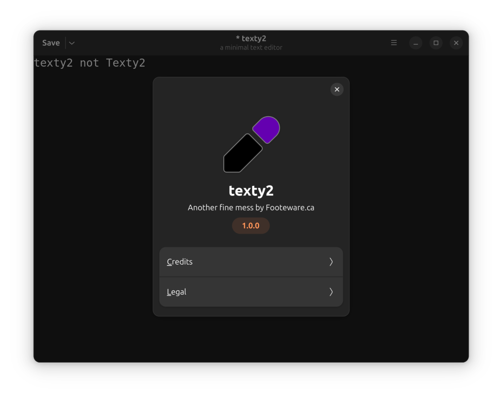

# texty2

a minimal text editor

---

First there was [texty](https://github.com/CraigFoote/ca.footeware.c.texty), written in C with Gtk4/Adw. It was a learning-C project. My conclusion was that C is nasty.

So came the idea of re-writing texty in python with Gtk4/Adw bindings. It was a learning-python project. It was much easier than C. Its name is texty2!

